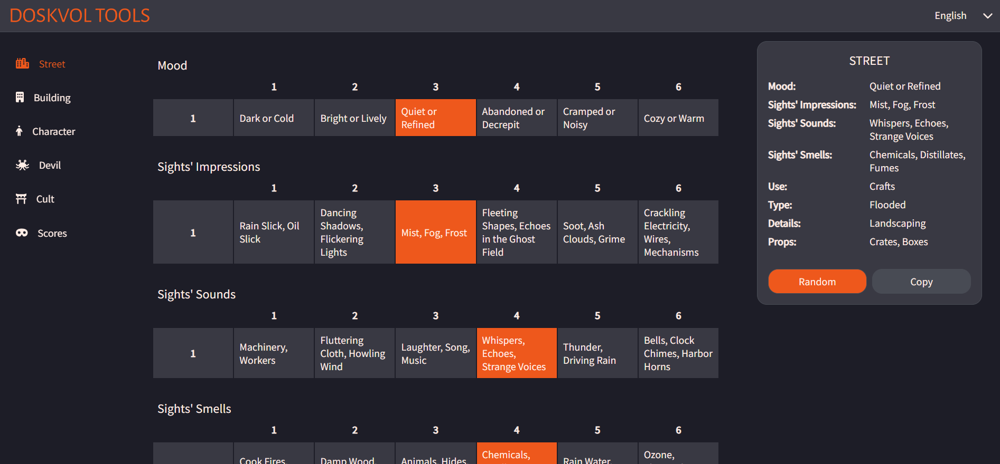

# DoskvolTools
Content generator for RPG game Blades In The Dark

Go to [Doscvol Tools](https://katarzyna-kadziolka.github.io/DoskvolTools/generator/street)

### Features
- Random generator for:
    - streets
    - buildings
    - characters
    - devils
    - cults
    - scores
- Possibility of manual selection of elements
- Convenient copying of generated content
- Supported languages: English and Polish

### Development
I am happy to accept suggestions for further development. Please feel free to add Issues :)

### Authors
- [Katarzyna Kądziołka](https://github.com/Katarzyna-Kadziolka)

### License
This project is licensed under the MIT License - see the [LICENSE](https://raw.githubusercontent.com/Katarzyna-Kadziolka/DoskvolTools/develop/LICENSE) file for details.

